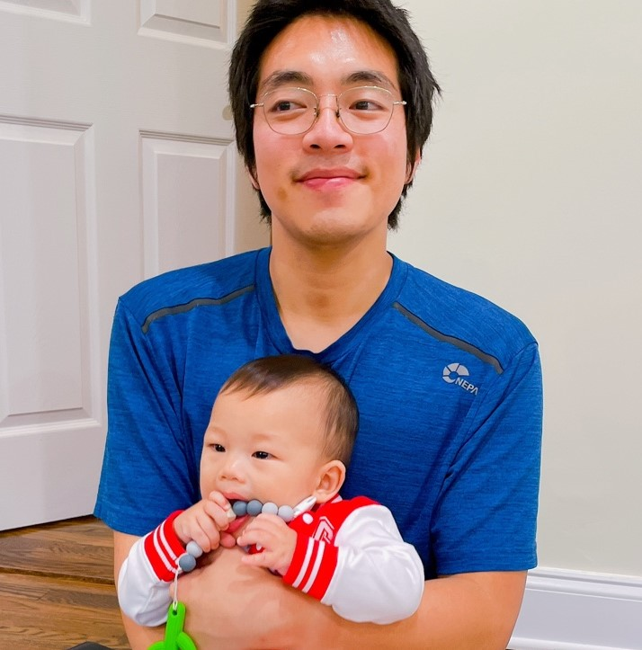

<left>

</left>

&nbsp;
  

I am a Ph.D. candidate in the field of Applied Economics and Management at Cornell University. My primary interest is food security and food policy. My area of interest include agricultural economics, applied econometrics, public policy and development economics.

Before coming to Cornell, I received B.S. from the University of Michigan in Ann Arbor. I worked as a research assistant at Innovations for Poverty Action (IPA) and Yale University, and as a consultant at Development Impact Evaluation (DIME) at the World Bank.